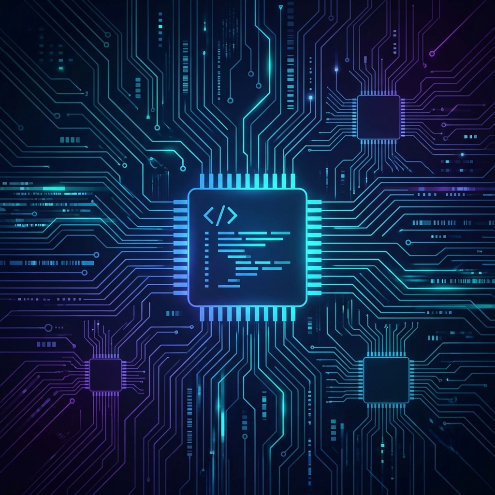

<!-- Dynamic Typing SVG -->

 

  
  
  
  
  

---

## ⚡ Technical Arsenal

### 🔩 Hardware Engineering

| Category | Skills & Tech Stack |
|---|---|
| **HDL** |     |
| **Architecture** |     |
| **Simulation** |     |
| **EDA** |     |
| **Protocols** |       |
| **Verification** |    |

---

### 💻 Software Engineering

| Category | Skills & Tech Stack |
|---|---|
| **Languages** |        |
| **Frontend** |     |
| **Backend** |     |
| **Databases** |     |
| **Systems & OS** |     |
| **Testing** |    |

---

### 🤖 AI / ML Engineering

| Category | Skills & Tools |
|---|---|
| **AI / Machine Learning** |      |
| **Deep Learning & GenAI** |     |
| **Data & Computer Vision** |    |
| **Software & Web** |       |

---

### ☁️ DevOps, Cloud & Infrastructure

  
  
  
  
  
  
  
  

| Category | Tools & Infrastructure |
|---|---|
| **Cloud Platforms** |    |
| **Containers & Orchestration** |   |
| **CI/CD** |   |
| **Infrastructure as Code** |   |
| **Observability** |   |

---

## 🌟 Featured Projects

<table align="center">
  <tr>
    <td width="50%">
      <h3 align="center">⚙️ Bit-Serial Neural Engine</h3>
      

        Designed and implemented an low-power neural computation accelerator utilizing <strong>bit-serial arithmetic</strong>.
      

      

        
        
        
      

      
<a href="https://github.com/ridash2005/Bit-Serial_Neural_Computation_Engine">🔗 View Project</a>

    </td>
    <td width="50%">
      <h3 align="center">🧠 Systolic Array CNN Accelerator</h3>
      

        Developed a high-throughput <strong>2D systolic array</strong> matrix multiplication engine optimized for CNN workloads. Synthesized and verified on Xilinx FPGAs using Vivado, achieving high resource utilization and optimized clock frequencies.
      

      

        
        
        
      

      
<a href="https://github.com/ridash2005/Systolic-Array-based-Hardware-Accelerator-for-CNNs">🔗 View Project</a>

    </td>
  </tr>
  <tr>
    <td width="50%">
      <h3 align="center">🔷 RISC-V Multi-Precision Core</h3>
      

        Developed a fully compliant <strong>RV32I/RV64I</strong> processor core from scratch. Implemented a 5-stage pipeline, hazard detection, forwarding units, and custom extensions for multi-precision hardware arithmetic.
      

      

        
        
        
      

      
<a href="https://github.com/ridash2005/RISC_V_Single_Cycle_Processor">🔗 View Project</a>

    </td>
    <td width="50%">
      <h3 align="center">🗺️ AutoPlacer — VLSI EDA Tool</h3>
      

        Built a VLSI <strong>cell placement optimization engine</strong> implementing simulated annealing and force-directed algorithms. Optimizes total wirelength (HPWL) and cell density to improve physical design metrics.
      

      

        
        
        
      

      
<a href="https://github.com/ridash2005/AutoPlacer">🔗 View Project</a>

    </td>
  </tr>
  <tr>
    <td colspan="2">
      <h3 align="center">⚡ CUDA Kernels — GPU Engineering</h3>
      

        Authored high-performance <strong>custom CUDA kernels</strong> for fundamental deep learning operations (SGEMM, 2D convolution, and FlashAttention-style primitives). Optimized memory access patterns via shared memory tiling, coalescing, and register usage to bridge the software-hardware gap.
      

      

        
        
        
      

      
<a href="https://github.com/ridash2005/CUDA_Kernels">🔗 View Project</a>

    </td>
  </tr>
</table>

---

## 📊 Developer Metrics

 

 

---

## 🏆 GitHub Trophies

  

---

---

  <h3>🔌 Let's build the future — from gates to gradients.</h3>
   
  <i>"The best AI systems are designed by engineers who understand the silicon they run on."</i>
    

  
  &nbsp;
  
  &nbsp;
  

